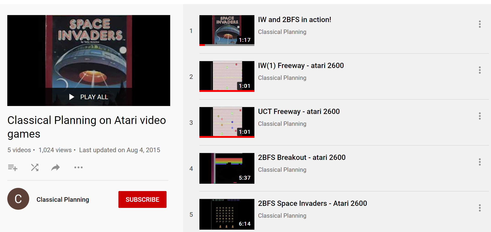

In this project we used width-based planning algorithms with a simulator instead of a PDDL description. We tested the planners on the The Atari 2600 games supported in The Arcade Learning Environment (ALE) \-- a platform for AI research.

See <http://www.arcadelearningenvironment.org> for details.

[](http://www.youtube.com/watch?v=P-603qPMkSg "Watch Classical Planners in Action!")

## Source Code


Download the code at [zip file](https://github.com/miquelramirez/ALE-Atari-Width/archive/master.zip) or copy the repository using the following command

    git clone https://github.com/miquelramirez/ALE-Atari-Width.git <directory>

will create a clone of the ALE master repository containing the game engine with the planners and the roms files of the tested games in `<directory>`. The directory is created if it does not yet exist.

## Atari Width-based planners

The Classical Planning algorithms are located in:

### IW(1)

- [src/agents/IW1Search.hpp](https://github.com/miquelramirez/ALE-Atari-Width/blob/master/src/agents/IW1Search.hpp)

- [src/agents/IW1Search.cpp](https://github.com/miquelramirez/ALE-Atari-Width/blob/master/src/agents/IW1Search.cpp)

### 2BFS

- [src/agents/BestFirstSearch.hpp](https://github.com/miquelramirez/ALE-Atari-Width/blob/master/src/agents/BestFirstSearch.hpp)

- [src/agents/BestFirstSearch.cpp](https://github.com/miquelramirez/ALE-Atari-Width/blob/master/src/agents/BestFirstSearch.cpp)

To compile, rename the makefile either for linux or mac

## Running ALE width-based planners

The command to run IW1 is

```
./ale -display_screen true -discount_factor 0.995 -randomize_successor_novelty true -max_sim_steps_per_frame 150000  -player_agent search_agent -search_method iw1  (ROM_PATH)`
```

The command to run 2BFS is

```
./ale -display_screen true -discount_factor 0.995 -randomize_successor_novelty true -max_sim_steps_per_frame 150000  -player_agent search_agent -search_method bfs  (ROM_PATH)`
```
and you have to substitute ROM\_PATH for any of the games under **supported\_roms** folder.

-   max\_sim\_steps\_per\_frame\* sets your budget, i.e. how many frames you can expand per lookahead. Each node is 5 frames of game play, so 150,000, is equivalent to 30,000 nodes generated. You don\'t need that many to find rewards, so you can use a smaller number to play the game much faster. 150,000 was the parameter chosen by Bellemare et al. The most expensive computation is calling the simulator to generate the successor state.

## Python scripts


We wrote scripts to make life easier for experimentation:

- `Evaluate_agents.py` may help you to run experiments.

We wrote some code to record the games, add the following flag to the `./ale` command

`-record_trajectory true`

and then you can replay the game using

- `replay.py <state_trajectory_alg_game_episode.i file>`

## Videos / papers


### Youtube

You can watch the width-basd planners in
[](http://www.youtube.com/playlist?list=PLXpQcXUQ_CwenUazUivhXyYvjuS6KQOI0)

### Paper

You can read more about it in the [IJCAI 2015 paper](http://people.eng.unimelb.edu.au/nlipovetzky/papers/iw-atari-ijcai-2015.pdf)

### Poster

You can also have a quick introduction to the approach by looking at the poster presented in [IJCAI](http://people.eng.unimelb.edu.au/nlipovetzky/papers/iw-atari-ijcai-2015-poster.pdf) too.

## Credits


We want to thank Marc Bellemare for making the ALE code available and the research group at U. Alberta.

The Classical Planning algorithms code is adapted from the Lightweight Automated Planning Toolkit (www.LAPKT.org).

This project is a joint work by Nir Lipovetzky, Miquel Ramirez and Hector Geffner.
