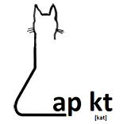

**LAPKT** stands for the **L**ightweight **A**utomated **P**lanning
Tool**K**i**T**. 

It aims to make your life easier if your purpose is to create, use or extend basic to advanced Automated Planners. It's an open-source Toolkit written in C++ and Python with simple interfaces
that give you complete flexibility by decoupling parsers from problem representations and algorithms. It has been succesfully used in embedded systems, webservices, compilations, replanning and contains some of the high-performance planners from the last International Planning Competition 2014.

## Overview


LAPKT separates search engines from the data structures used to represent planning tasks. This second component receives the name of 'interface' since it is indeed the interface that provides the search
model to be solved. 

At the moment of writing this, the following interfaces are offered:

-   `agnostic`: this interface does not depend on a particular planning language, so it is easy to wrap PDDL parsers, separating parsing representation of planning tasks from a representation optimized for off-line planning. This interface should also make easy to integrate STRIPS planners into applications by suitably defining planning tasks programatically.
-   `ff`: this interface wraps FF parsing components to obtain `agnostic` looking tasks.
-   `fd`: this interface wraps FD parsing components to obtain `agnostic` looking tasks.

Future interfaces planned are:

-   `VAL`: this interface wraps VAL parser, which supports parsing of
    PDDL+ features.
-   `SAS+`: this interface is meant to support SAS representations
    natively. Since there is no SAS-based planning language, this will
    probably be useful to integrate planners into applications that are
    able to define SAS planning tasks programatically.
- `Tarski`: this interface will be used to parse, or build STIPS and more expressive models.

Search engine components are meant to be modular, allowing users of LAPKT to assemble and combine features of different search engines to come up with customized search strategies, within reason and without sacrificing (much) efficiency. In order to do so, LAPKT makes heavy use of C++ templates and the Static Strategy design pattern.

## News!


### 1M solver calls @ planning.domains

One of our planners, [siw-then-bfs](https://github.com/LAPKT-dev/LAPKT-public/tree/master/planners/siw_plus-then-bfs_f-ffparser) has reached over 1M calls in the remote solver handling the calls in the [editor.planning.domains](http://editor.planning.domains/)

<blockquote class="twitter-tweet" data-lang="en"> <a href="https://twitter.com/cjmuise/status/1263538966046916608">May 22, 2020</a></blockquote> <script async src="https://platform.twitter.com/widgets.js" charset="utf-8"></script>

### Sparkle Planning Challenge 2019

The Sparkle Planning Challenge automatically combines all participating planners into a state-of-the-art planning selector, and assesses the contribution of each participating planner to the performance of that planning selector.


[Results](http://ada.liacs.nl/events/sparkle-planning-19/results.html) and [Slides](http://ada.liacs.nl/events/sparkle-planning-19/documents/slides/Sparkle_ICAPS.pdf)

<center>

#### WINNER: PROBE


#### RUNNER-UP: DUAL-BFWS

</center>

The planners that got the **1st and 2nd positions** were **PROBE** (based on an early version of LAPKT) and **DUAL-BFWS**.


### International Planning Competition (IPC) 2018

[Results](https://ipc2018-classical.bitbucket.io/#results) and [scores
overview](https://ipc2018-classical.bitbucket.io/scores.html)

<center>

#### WINNER of the Agile Track

**BFWS-preference**

corresponds to [BFWS planner](https://github.com/nirlipo/BFWS-public) using option

    --BFWS-f5

</center>
<center>

#### RUNNER-UP of the Satisficing Track

**DUAL-BFWS**

 corresponds to [BFWS planner](https://github.com/nirlipo/BFWS-public) using option 

    --DUAL-BFWS

</center>

For more information about submitted BFWS planners, read this summary [width-ipc-paper](https://ipc2018-classical.bitbucket.io/planner-abstracts/teams_1_20_30_31_36_47.pdf)

### IPC 2014 Agile track

Once we fixed the bug on the submission of [IPC'8](http://helios.hud.ac.uk/scommv/IPC-14/) (International Planning Competition 2014), we were computing $h^2$ but not using it, our planners **BFS\_f, DFS+, and SIW+** are the **fastest in the AGILE track (minimize CPU time)** compared to the last winner, according to our experiments using the benchmarks from the competition.


## Contact & Contributing


We welcome anybody in the planning community to contribute into LAPKT, either by just using it or by submitting code implementing stuff they feel should be in an \"Automated Planning Toolkit\". We only request two things from you. First, to abide to the terms and conditions of the Apache License,      Version 2.0, January 2004 (http://www.apache.org/licenses/). Second, to drop a note on us telling about what you plan to add or what you think should be changed.

You can contribute to LAPKT by submitting code or discussing [issues @ github](https://github.com/LAPKT-dev/LAPKT-public/issues).

General questions: Miquel Ramirez and Nir Lipovetzky \<firstname.surname\@unimelb.edu.au\>

## Citing LAPKT


You can use cite LAPKT in your publications like this:
```
 @misc{lapkt,
   title = {{Lightweight Automated Planning ToolKiT}},
   author = {Miquel Ramirez and Nir Lipovetzky and Christian Muise},
   howpublished = {\url{http://lapkt.org/}},
   year = {2015},
   note = {Accessed: 2020}
}
```

